# Introdução a git e a versionamento de código - semcomp beta
## Manual de contribuição
Neste repositório, vamos criar suas primeira contribuições "Open Source"
1. Para isso, crie um fork do repositório para o seu perfil

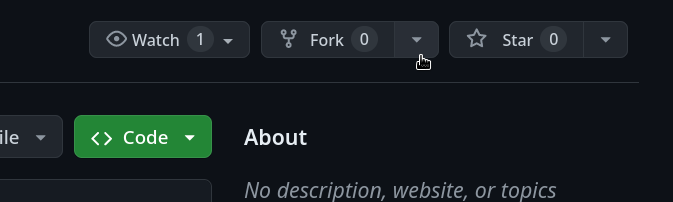
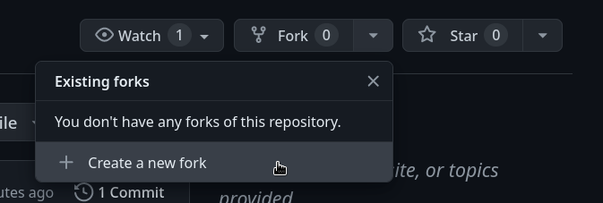
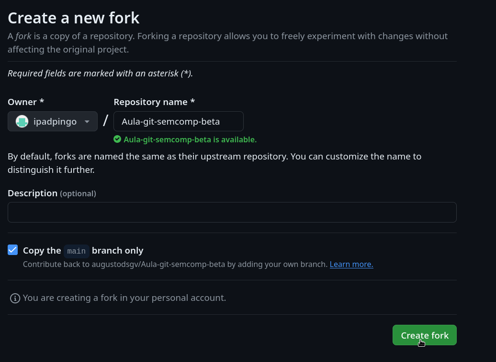

3. Entre no seu repositório "forkeado"

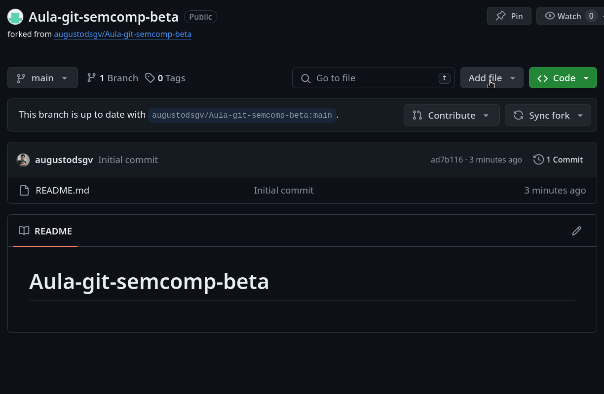
4. Adicione um arquivo novo com suas informações

5. Faça um commit dele (ainda em seu repositório)

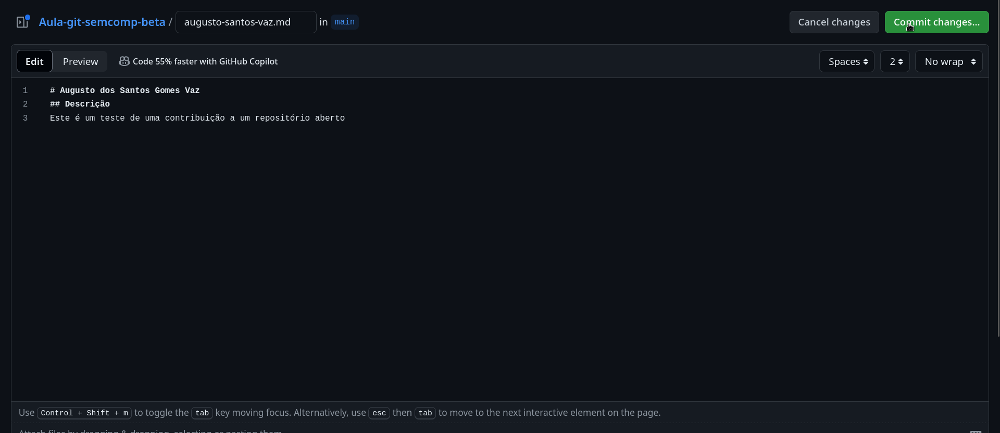
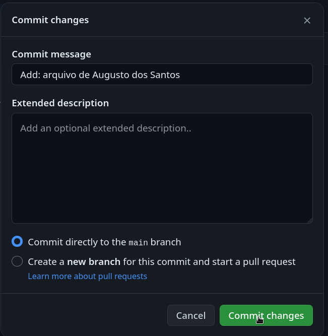
6. Crie um pull request para o repositório original (ainda em seu repositório)

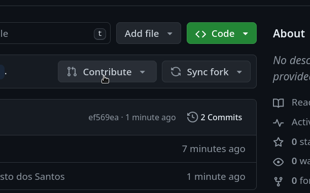
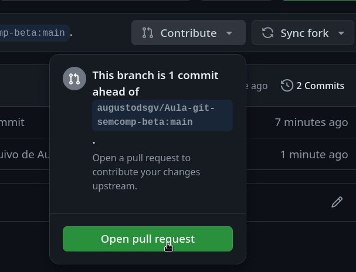
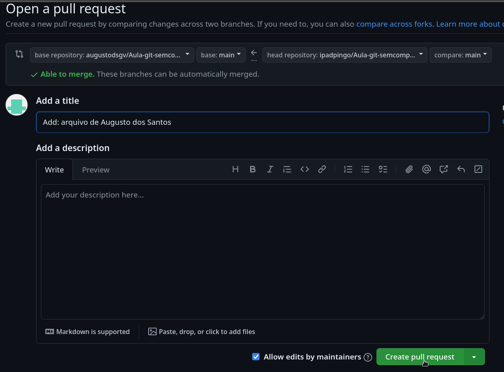

7. Pronto! Agora seu pull request foi feito e está aguardando no repositório original para ser aceito!

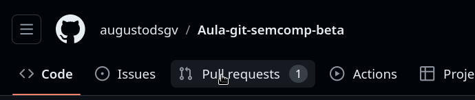
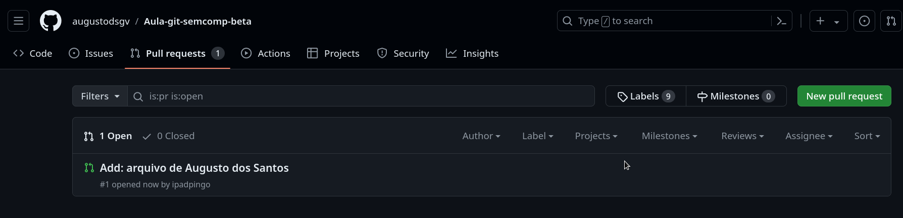
